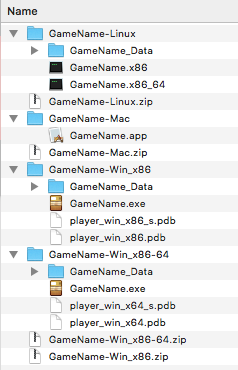

# Building and Releases

Here's a guide for building executables in Unity. If anything else, (ie: RPG Maker, Game Maker, Construct), please try to build a Mac, Windows and Linux versions if available. You don't need to pay for the exporter if that's the only way to export to other OSes. 

## Building from Unity
If your project is using Unity, here are the formats that should be added to a release:

1. Linux 
2. Mac 
3. Windows 32bit 
4. Windows 64bit

### Create "Build" folder
Before starting, make a folder named _Build_ (notice no "s" at the end)! If you initialized your project's .gitignore from GitHub, these files will be ignored, which is what you want. You do not want to check in the _Build_ folder, you are supposed to create a Release in GitHub and attach it to that!

### No development builds!
Also, make sure "Development Build" is **unchecked**, especially when exporting to Mac, otherwise, you will have to read http://superuser.com/questions/478768/running-app-on-macosx-mountain-lion-job-failed-to-exec3-for-weird-reason-13 and use a Mac to do chmod u+x <Application.app>/Contents/MacOS/<application binary> to produce a working version!

Here are the steps in **File -> Build Settings** to do each version:

### Linux

1. Select Target Platform - Linux
2. Select Architecture - x64 + x86_64 (Universal)
3. Click **Build**
4. In your project's folder, **use the folder named Build**, and then create a folder named _ProjectName_\-Linux
5. Name the executable the name of your project. _NOTE:_ Eventhough it defaults the name to .x86, it will create an executable for bot x86 and x86_64. 
6. Wait.
7. Zip up the folder _ProjectName_\-Linux

### Mac OS

1. Select Target Platform - Mac OS X
2. Select Architecture - x86_64
3. Click **Build**
4. In your project's folder, **use the folder named Build**, and then create a folder named _ProjectName_\-Mac
5. Name the executable the name of your project.
6. Wait.
7. Zip up the folder _ProjectName_\-Mac

_NOTE: This configuration will work on most Macs since 2006 and will run on Mac 10.6+_

### Windows

1. Select Target Platform - Windows
2. Select Architecture - x86
3. Click **Build**
4. In your project's folder, **use the folder named Build**, and then create a folder named _ProjectName_\-Win_x86
5. Name the executable the name of your project.
6. Wait.
7. Zip up the folder _ProjectName_\-Win_x86
8. Select Target Platform - Windows
9. Select Architecture - x86_64
10. Click **Build**
11. In your project's folder, **use the folder named Build**, and then create a folder named _ProjectName_\-Win_x86_64
12. Name the executable the name of your project.
13. Wait.
14. Zip up the folder _ProjectName_\-Win_x86-64

### Files make
When done, you should have a bunch of zip files, and folders like so:

## Release
Follow the instructions for [Creating Releases](https://help.github.com/articles/creating-releases/), and upload your zip files for your project.

The version number should be V0.1-prototype for the Prototype. If you have to create a new release of you prototype, just increment the number keep the v0.x-prototype numbering. 

For the Beta it will be v0.1-beta or v0.x-beta if you have additional releases. 

For Gold, use v1.0.0.

