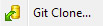
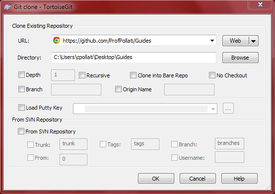
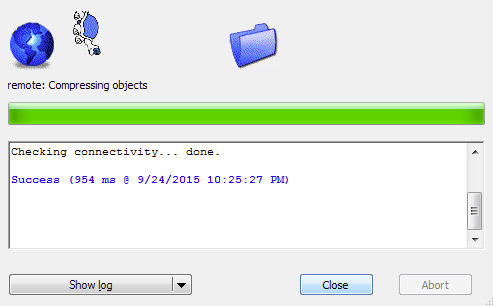
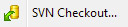
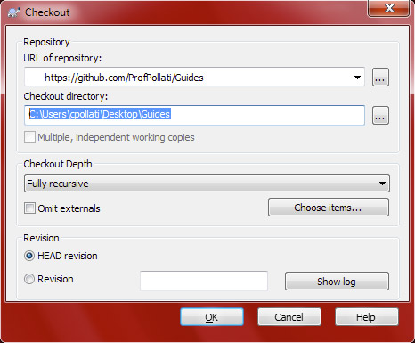

#Getting Stuff

Once a repo has been made it's time to start working on it! 

## GitHub Desktop 
If you are using Github Desktop, read about [cloning a repo](https://help.github.com/desktop/guides/contributing/) from their documentation. You can also click on the  button in GitHub.

## TortoiseGit - *Git Clone*
If you are using TortoiseGit, you can clone a GitHub repo like this:

* Find the "Subversion URL" box. Even though this says Subversion, it's also the same URL for doing a Git checkout! Click on the little *Copy to clipboard* button next to the URL

  
  
* In Windows Explorer, go to the folder you would like to keep a working copy in.

* Right click and select "Git Clone..."

  

* TortoiseGit should pop up, and have the URL filled in with what was copied from GitHub. You should be able to leave all options as is and click 

  

* If the repo is private, TortoiseGit may ask for a username and password

* Depending on the size of the repo, and your internet connection, you may be watching the progress bar for a while.

  
  
* Once it's complete, you can start modifying it and then [send your changes](../Sending-Stuff/README.md)

## TortoiseSVN - *SVN Checkout*
* Find the "Subversion URL" box. Even though this says Subversion. Click on the little *Copy to clipboard* button next to the URL

  
  
* In Windows Explorer, go to the folder you would like to keep a working copy in.

* Right click and select "SVN Checkout..."

  

* TortoiseGit should pop up, and have the URL filled in with what was copied from GitHub. You should be able to leave all options as is and click 

  

* If the repo is private, TortoiseSVN may ask for authentication. Use your GitHub username and password.

* Depending on the size of the repo, and your internet connection, it may take a while to download all the files.
  
* Once it's complete, if you open the folder, you will notice that there are two folders *branches* and *trunk*. You will want to work in the *trunk*, since this is the default folder for what is actively developer. If there were any branches of the repo in GitHub, they would end up in the *branches* folder.
So now you can dive into that *trunk* folder and start modifying it. Once you are done and check out how to [send your changes](../Sending-Stuff/README.md)
