#Installing TortoiseGIT

To use TortoiseGIT and get the easy to use context menus, there are a few step you need to do. You will need an adminstrator access to install these. This guide was written with Git for Windows 2.5.3, if using a different version, you might see different options. For the most part we will use the default options.

## Install [Git for Windows](https://git-for-windows.github.io/ Git for Windows)

* Visit <https://github.com/git-for-windows/git/releases/latest> and scroll down to the Downloads. 

* You'll want to download the version that is appropriate for your computer, either Git-x.x.x-32-bit.exe for a 32-bit Windows, or Git-x.x.x-64-bit.exe for 64-bit Windows. 

    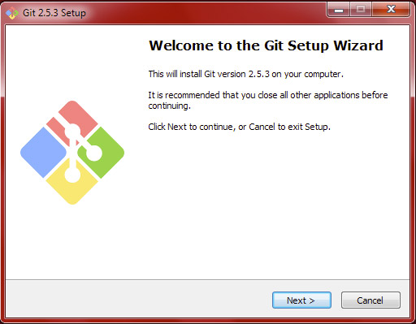

* Click next

    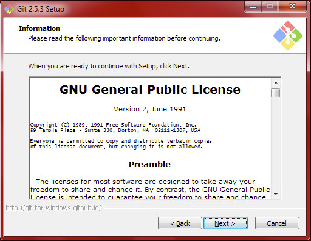

* Accept the GNU General Public License V2

    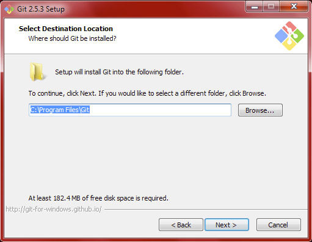

* The Default destination of *C:\Program Files\Git* should be fine

    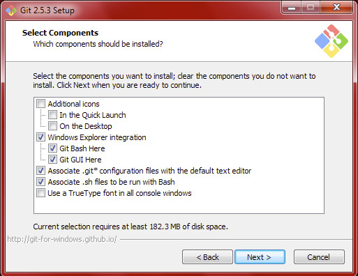

* You can leave the default components. Maybe you want to use TrueType font in all console windows if you like pretty fonts.

    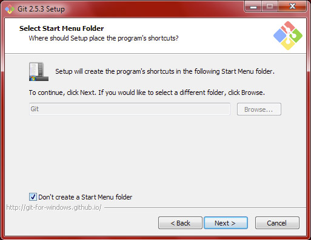

* Since we will be installing TortoiseGIT, we don't need to create any Start Menu short cuts

    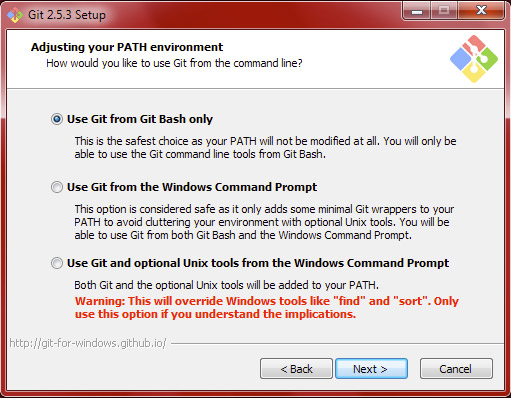

* You can leave *Use Git from Git Bash only* unless you expect to use the Command Prompt for issuing Git commands directly.

    

* You can leave the *Checkout Windows-style, commit Unix-style line endings*. This way, when you edit in Windows, line breaks will appear correct, and then when they are committed, they appear normal for Linux and Mac users.

    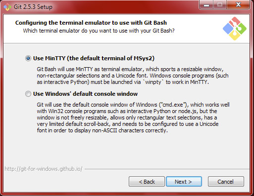

* You can leave the *Use MinTTY (the default terminal for MSys2)* 

    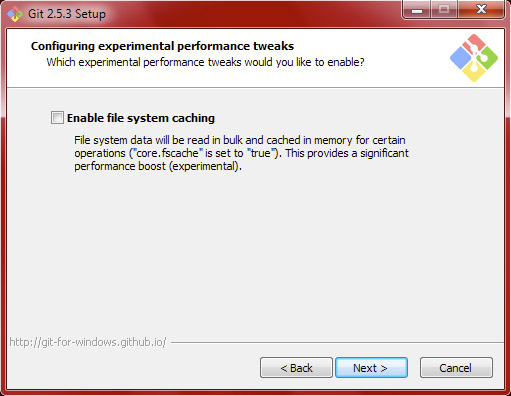

* Unless you are daring, we'll leave the *Enable file system caching* off since it is still considered experimental

    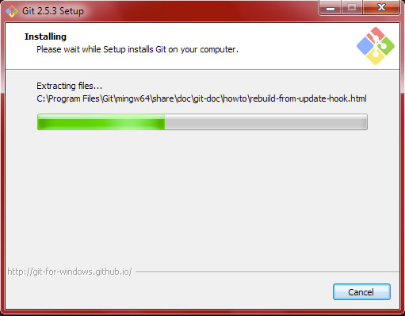

* Sit back and wait for it to complete!

    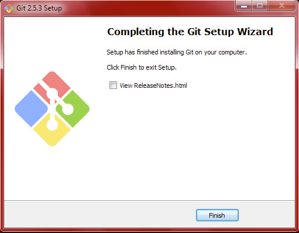

## Install [TortoiseGIT](https://tortoisegit.org/)

* Visit <https://tortoisegit.org/download/> and select the appropriate version for your computers (either 32-bit or 64-bit)

    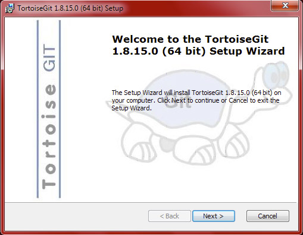

* Click *Next* and start going!

    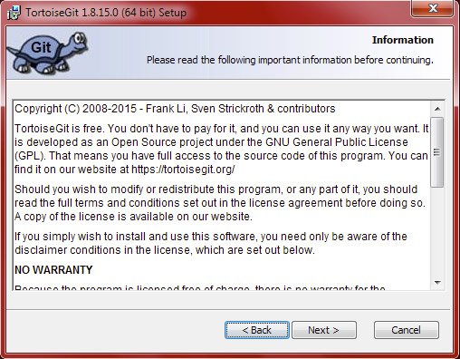
    
* Read the entire license and accept!

    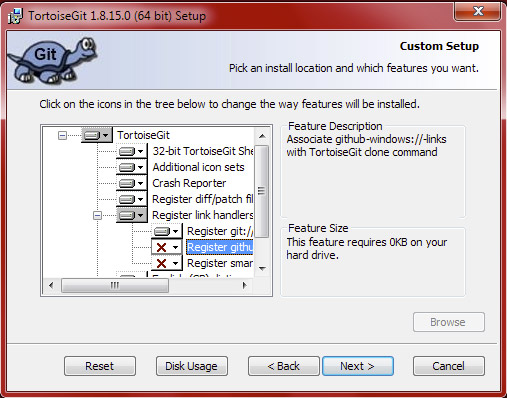
    
* The default options are fine. You may want to choose to not install the *English (GB) dictionary* if you are pressed for 764KB of harddrive space

    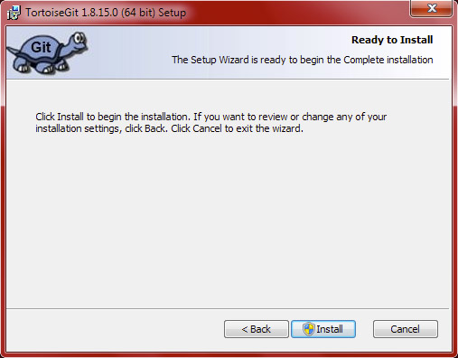
    
* Now, just click *Install*, if you are not an administrator, now it will ask for the administrator's password

    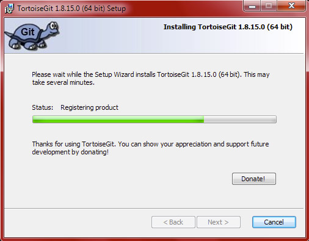
    
* Wait for it to install. At first, it may seem like nothing is happening, but after several seconds, the progress bar should start moving

    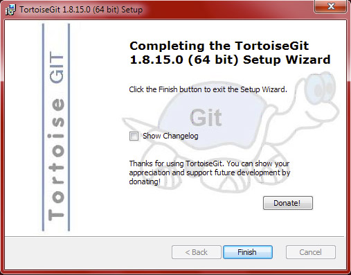
    
* That's all folks! You can now Git away until your heart's content with TortoiseGit!

