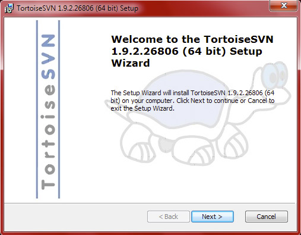
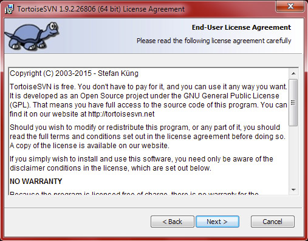
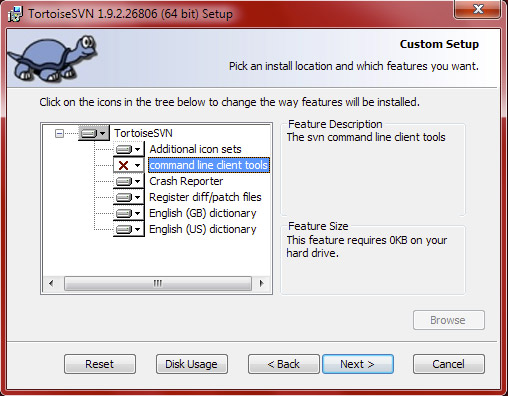

# Installing [TortoiseSVN](http://tortoisesvn.net/)

To use TortoiseSVN and get the easy-to-use context menus, you just have to follow these following steps. This guid eis written for TortoiseSVN 1.9.2, 

* Visit <http://tortoisesvn.net/downloads.html> and download the version that is appropriate for your computer, either 32-bit Windows or 64-bit Windows.

  

* Click *Next*

  

* Read the license and accept it

  

* You can leave the defaults installs, maybe to save a meg of hard drive space you might want to not install the *English (GB) dictionary*, or you might want to install the *command line client tools* if you like using the Command Prompt. 

  

* Click *Install* and if you are not an administrator, you are going to need one to enter their password!

  

* Wait for it to install. At first, it may seem like nothing is happening, but eventually it will start chugging away

  

* Sit back and start using version control!
