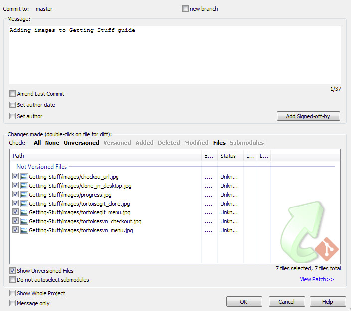
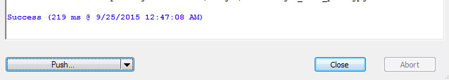

#Sending Stuff to GitHub

Once you have made all your changes you can then send all your work to GitHub for everyone to see

## GitHub Desktop
GitHub desktop gives you a list of all the files that have changed. All you have to do is:

* Select which files to submit

* Enter your commit summary and detailed description

* Hit Commit to Master.

Remember, this is only going to your repo on your machine. If you want to send it to GitHub for others to see you have to also do:

* Click on *Sync*

If you really want to always send all you changes to GitHub you can check off the option in the menu **Edit -> Automatically Sync after Committing**

## TortoiseGit - *Git Commit -> "master"*
Once you have your code set up and you want it to be available to others via GitHub

* Right click on the folder in explorer and select *Git Commit -> "master"*

  
  
* If you haven't done a Git Commit yet, TortoiseGit will ask for User Information which you will have to fill in your Name and Email.

* Fill in the message with why you are submitting these changes. Then select all the files that you want to commit in the *Changes made* area. Once this is good, you can hit *OK*.

  
  
* Git works from a repo that is stored on your machine. In order for others to see these changes, you also have to "push" the file. Before you click close, click on the "Push... button. 

  
  
  However, if you forget, later you can also right click and select " **TortoiseGit -> Push...**
  
  
  
  So, let push those changes!
  
* TortoiseGit may ask you for your GitHub login, so enter it

* Depending on how much you are submitting and you internet connection, this may take some time before it finishes sending.

## TortoiseSVN - *SVN Commit*
Working with SVN is a little more straight forward when committing since all commits go right to GitHub.

* Right click over the folder and select *SVN Commit*

* Select the files you want to submit

* Fill out the message about why you are submitting those files

* Hit *OK*

* Depending on your connection speed and how much you are sending, you might have to wait awile before the commit completes.
