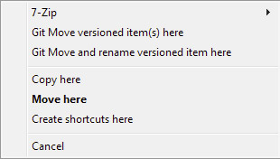
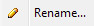
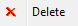
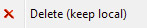
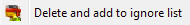

# Working with Tortoise
TortoiseGit and TortoiseSVN give you a little more manual control over what files are involved with your repository. It takes a little getting used to, but it make working with version control software like using Windows Explorer.

For more information about TortoiseGit, read the [TortoiseGit Daily Use Guide](https://tortoisegit.org/docs/tortoisegit/tgit-dug.html)

For more information about TortoiseSVN, read the [TortoiseSVN Daily Use Guide](http://tortoisesvn.net/docs/release/TortoiseSVN_en/tsvn-dug.html)

### Icon Overlays
TortoiseGit and TortoiseSVN add icon badges to files in repositories. (Note: If you have both installed, there are tiems where the badges may not show up on the desktop.

#### TortoiseGit Overlays

For more infomation on what each of these icons means, read [TortoiseGit - Getting Status Information](https://tortoisegit.org/docs/tortoisegit/tgit-dug-wcstatus.html#tgit-dug-wcstatus-1)

#### TortoiseSVN Overlays

For more infomation on what each of these icons means, read [TortoiseSVN - Getting Status Information](http://tortoisesvn.net/docs/release/TortoiseSVN_en/tsvn-dug-wcstatus.html#tsvn-dug-wcstatus-1)

### Add new files
While you can select the new files to add while you do a commit, for both TortoiseGit and TortoiseSVN, when you add new files you need to tell Tortoise that you want to add them with either **TortoiseGit -> Add..** or **TortoiseSVN -> Add...**

For more details, read:

[TortoiseGit - Adding New Files](https://tortoisegit.org/docs/tortoisegit/tgit-dug-add.html)

[TortoiseSVN - Adding New Files And Directories](http://tortoisesvn.net/docs/release/TortoiseSVN_en/tsvn-dug-add.html)

### Copy and Move Files
The easiest way to copy or move files is to **right drag** a file or folder to it's destination. When you let go, depending which Tortoise you are using will give you different options:

  * With TortoiseGit, if you can move items with a right drag.
  
  
  
  If you want to copy files with their history, you will need to do a *Branch*. However, if you do not need to keep their history, you can just do a plain **Copy here** and then add them using **TortoiseGit -> Add...**

  * With TortoiseSVN, right drag will allow you to SVN Move and SVN Copy items. This will allow you to keep versioning history.

  

### Delete/Rename Files
If the file is added to the repo, you need to remember to use the Tortoise commands to ensure that these changes will be made in the repo!

Note: TortoiseGit also includes an option to delete the file from the repo, but keep it on your computer.

More info:

[TortoiseGit - Deleting, Moving and Renaming](https://tortoisegit.org/docs/tortoisegit/tgit-dug-rename.html)

[TortoiseSVN - Copying/Moving/Renaming Files and Folders](http://tortoisesvn.net/docs/release/TortoiseSVN_en/tsvn-dug-copy.html)

### Ignore Files
Sometimes, there are files you do not want versioned. In our case with Unity, Library/ and Temp/ should be ignored. If you didn't do this when creating the repo in GitHub, you can still do this by selecting the folders or files you want to ignore and then do either **TortoiseGit -> Delete and add to ignore list**, or **TortoiseSVN -> Unversion and add to ignore list**.

More info:

[TortoiseGit - Ignoring Files and Directories](https://tortoisegit.org/docs/tortoisegit/tgit-dug-ignore.html)

[TortoiseSVN - Ignoring Files and Directories](http://tortoisesvn.net/docs/release/TortoiseSVN_en/tsvn-dug-ignore.html)

